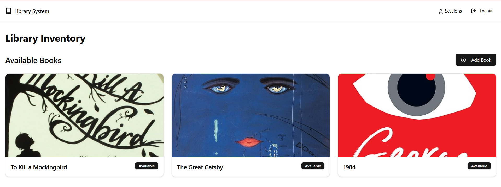

# Library Management System

This is a simple library management system built with Next.js, Drizzle ORM, and Better Auth.



## Getting Started

### Prerequisites

- Node.js 18.x
- PostgreSQL 15.x

### Installation

1. Clone the repository:

```bash
git clone https://github.com/MalekD5/PremierLibrary.git
```

2. Install dependencies:

```bash
npm install
```

3. Create a `.env` file in the root directory and add the following environment variables:

```bash
DATABASE_URL=
BETTER_AUTH_SECRET=your_secret # generate a new secret using `openssl rand -hex 32`
BETTER_AUTH_URL=http://localhost:3000
```

4. Run the database migration, this will setup the database schema and create the necessary tables:

```bash
npm run db:generate
npm run db:migrate
```

5. (**optional**) Seed the database (adds default books to the database): 

```bash
npm run db:seed
```

6. Start the development server:

```bash
npm run dev
```

7. Open http://localhost:3000 in your browser.

## License

This project is licensed under the [MIT License](LICENSE).